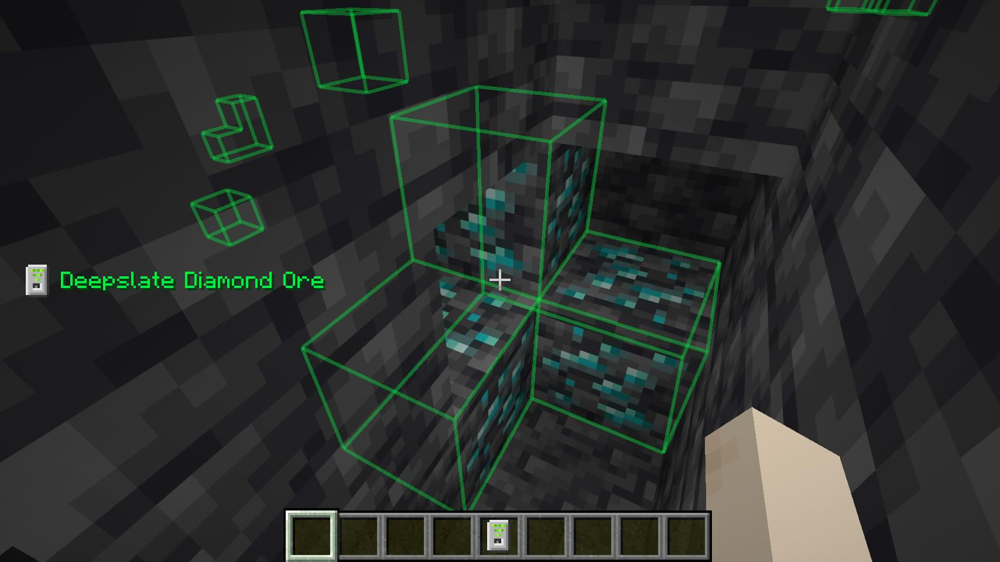

# BlockScanner

This mod provides a scanner that lets you search for hidden ores easily. Very handy when you're in search of diamonds or ancient debris. 

The tracking happens server side, so it can't be used to cheat on servers to find ores: the server administrator has to intentionally install this mod in order for it to work.

The scanner can be configured with any of the ore blocks (including ancient debris) by placing the ore block in the scanner. This requires you to manually find at least one of the ore you're scanning for. But once you've configured the scanner and enabled it (with the hotkey, default "K"), you're good to go. The scanner scans for blocks in a 20 block range around you (so a 41x41x41 area).

## Recipe

 

You need 3 emeralds, one diamond and 5 iron ingots to create a scanner.

## License

This mod is availabe under the MIT license.
